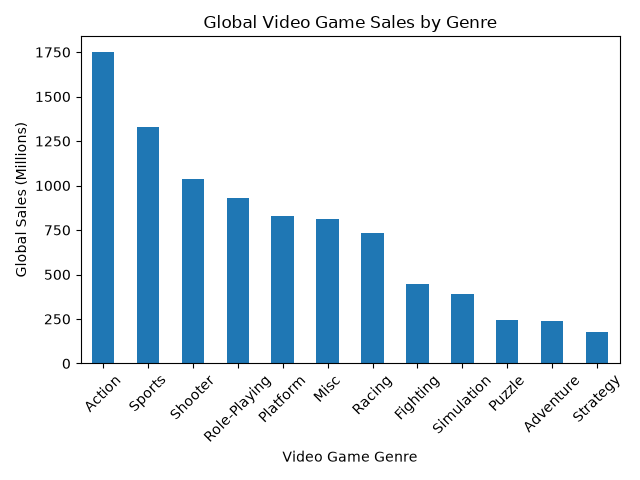
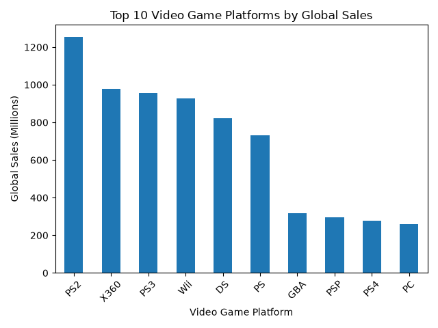
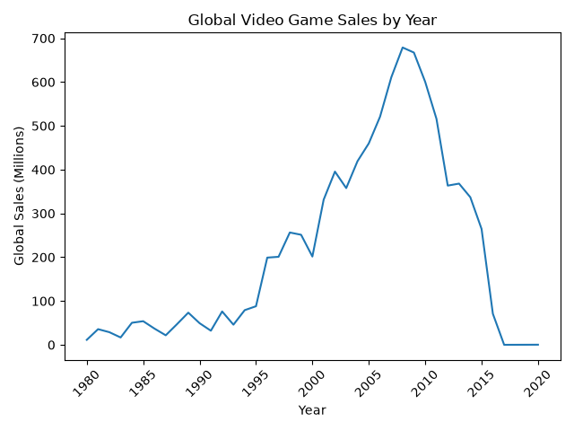
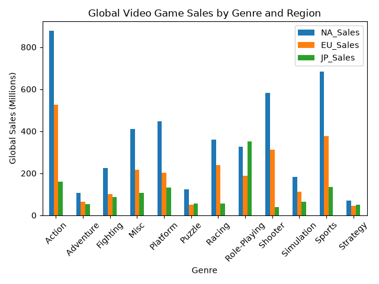

# Video Game Sales Analysis

## Project Overview
This project analyzes video game sales data to find useful information such as the top 10 best-selling games, sales across different genres and regions, top-performing platforms, and how video game sales have changed over time.

## Dataset
The dataset used for this project is the Video Game Sales dataset from Kaggle. It contains 16,598 video games with information including the game title, platform, release year, genre, publisher, and sales in North America, Europe, Japan, other regions, and globally.

## Tools Used
- Python: Used to write the data analysis program
- Pandas: Used to load, organize, clean, and analyze the dataset
- Matplotlib: Used to create graphs of the data
- PyCharm: Used to run and write the python code

## Analysis 
The project explores multiple areas of the video game sales dataset:

- Identifies the top 10 best-selling video games globally
- Compares total global sales across different genres
- Identifies the top 10 platforms based on global sales
- Examines how global video game sales changed over time
- Compares genre sales across North America, Europe, and Japan
- Identifies the top-selling genre in each region

## Key Findings 
- Wii Sports was the best-selling game in the dataset with 82.74 million copies sold globally.
- Action was the highest-selling genre, with 1.75 billion copies sold globally.
- PS2 was the highest-selling platform in the dataset, with about 1.26 billion copies sold globally.
- 2008 had the highest global video game sales in the dataset, with 678.9 million copies sold that year.
- Both North America and Europe had Action as their highest-selling genre, while Japan's highest-selling genre was Role-Playing.

## Visualizations

### Global Video Game Sales by Genre

### Top 10 Video Game Platforms by Global Sales

### Global Video Game Sales by Year

### Video Game Sales by Genre and Region

## Data Limitations
- When analyzing the Year column, I found that 271 games were missing their release year. I used `dropna()` to exclude those games from the analysis by year.
- The dataset seems to have incomplete data for more recent years, so those sales numbers may not accurately represent actual video game sales.

## How to Run
1. Download or clone this repository.
2. Make sure Python is installed.
3. Install the required libraries using `pip install -r requirements.txt`.
4. Run `analysis.py`.
